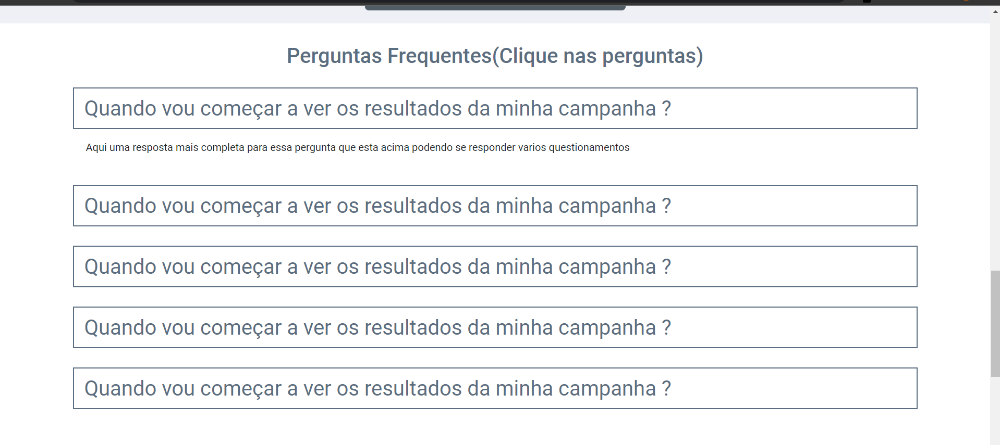
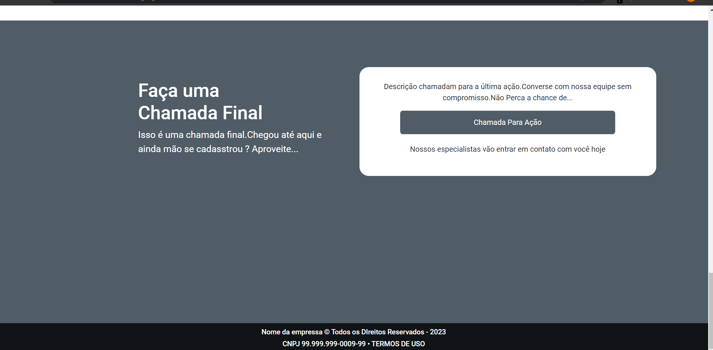

# PROJETO
Landing Page

# COMO INSTALAR PROJETO 
Instale o Banco de Dados SQL que esta na pasta raiz do projeto

# IMAGENS DO PROJETO

### Existe Animação em jquery na img abaixo

### Efeito Sanfona na imagem abaixo

